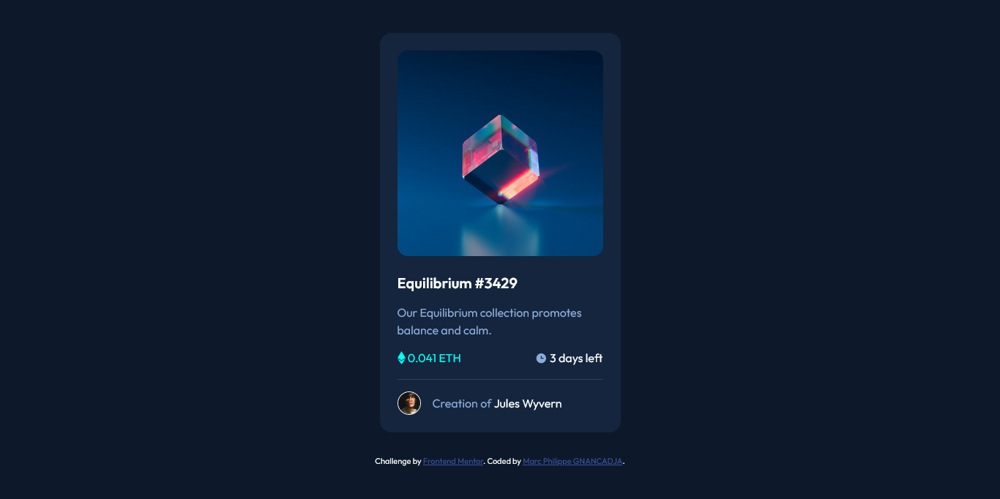

# Frontend Mentor - NFT preview card component solution

This is a solution to the [NFT preview card component challenge on Frontend Mentor](https://www.frontendmentor.io/challenges/nft-preview-card-component-SbdUL_w0U). Frontend Mentor challenges help you improve your coding skills by building realistic projects. 

## Table of contents

- [Overview](#overview)
  - [The challenge](#the-challenge)
  - [Screenshot](#screenshot)
  - [Links](#links)
- [My process](#my-process)
  - [Built with](#built-with)
  - [What I learned](#what-i-learned)
  - [Continued development](#continued-development)
- [Author](#author)
 

## Overview

### The challenge

Users should be able to:

- View the optimal layout depending on their device's screen size
- See hover states for interactive elements

### Screenshot

 

### Links

- Solution URL: [https://github.com/Marc-Philippe-dev/ntf-preview-card-component] 
- Live Site URL: [https://marc-philippe-dev.github.io/nft-preview-card-component/] 

## My process

### Built with

- Semantic HTML5 markup
- CSS custom properties
- Flexbox
- CSS Grid
- Mobile-first workflow
 
 

### What I learned

Through out this challenge , I've learnde how to deal with element position with css position property. 

 
### Continued development

I wil keep doing front-end Mentor challenges which help you grow as web developer. 

## Author

- Frontend Mentor - [@Marc-Philippe-dev](https://www.frontendmentor.io/profile/@Marc-Philippe-dev)
- Twitter - [@MarcGnancadja](https://www.twitter.com/MarcGnancadja)

 